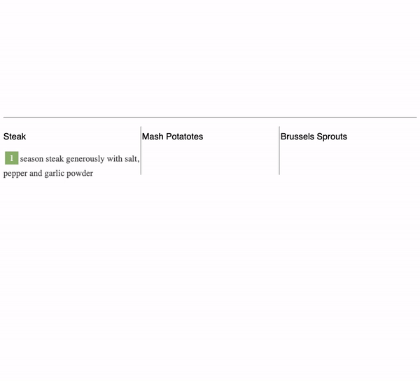

# LAB | #Promise me a dinner

## Introduction

Due to the asynchronous nature of Javascript promises & callbacks are very important. Both allow us to control the flow of the operations, meaning its sequence.

## Requirements

- Fork this repo
- Clone this repo

## Submission

Upon completion, run the following commands:

```
$ git add .
$ git commit -m "done"
$ git push origin master
```

Create Pull Request so your TAs can check up your work.

## Instructions

### Iteration 0 | The starter code

We provided you with some starter code:

- in the `data.js` we provided you with the arrays of steps to preparing 3 different foods: _steak_, _brussels sprouts_, and _mash potatoes_.
- in the `public/javascripts/addFood.js` file there is a function `addFood(step, id, callback)` that mimics the asynchronous nature of JavaScript. **You should not make any changes in this file.**
- in the `public/javascripts/script.js` file, we gave you a simple `for` loop to show you how the code should execute, but in the provided code there are no callbacks nor promises to handle the asynchronicity, so the steps won't print in the correct order.
- in the `index.html` file, there is base HTML structure needed so no need to add any code there. All already mentioned JavaScript files are already linked to the `index.html`. The `data.js` loads first to make sure variables that hold instructions to preparing food are already loaded and can be used in other files, where we need them.

### Out of sync

Notice how the steps to cooking the food are out of order, and all the images are already displayed on the table.

<!--  -->


**You should write your solution in the `public/javascripts/script.js` file.**

## Iteration 1 | Make the steak with callbacks

Using callbacks print the directions to make Steak in the correct order. Write your JavaScript in the provided `public/javascripts/script.js` file. Once again, a reminder not to alter the `addFood.js` file.

```javascript
addFood(steak[0], '#steak', () => {
  // ... your code here
});
```

## Iteration 2 | Make the mash potatoes with promises

Using promises and the `then` statement print the directions to make Mash Potatoes in the correct order.

```javascript
addFood(mashPotatoes[0], '#mashPotatoes').then(res => {
  // ... your code here
});
```

## Iteration 3 | Make the brussels sprouts with async/await

Using promises with the `async` and `await` syntax print the directions to make Brussels Sprouts in the correct order

```javascript
async function makeFood(steps, id) {
  // ... your code here
}
```

## BONUS 1

When the specific food is ready to be served (all steps are listed), add the image that represents that food to the `#table` div.

## BONUS 2

Using `promise.all` when all dinner items (Steak, Mash Potatoes, and Brussels Sprouts) are all done and added to the table, alert **_Dinner is served!_**

**Final should look like this - all the steps are in the correct orders**:


<!--  -->

**Happy coding!** :heart:
